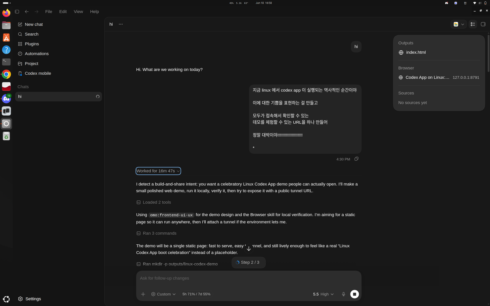

# Codex App on Linux

<p align="center">
  
</p>

<p align="center">
  <strong>Proof that the Codex desktop app can run locally on Linux via an unofficial wrapper build.</strong>
</p>

<p align="center">
  <a href="reports/final-validation.md">Validation report</a> ·
  <a href="evidence/build/build-info.json">Build info</a> ·
  <a href="evidence/gui/webview-smoke-result.txt">Smoke test</a>
</p>

> [!WARNING]
> Experimental proof of concept. This is **not** an official OpenAI Linux release and does **not** redistribute Codex Desktop, `Codex.dmg`, or generated app bundles.

## Summary

OpenAI ships the Codex desktop app for macOS and Windows. Linux is officially supported through Codex CLI, not a native desktop app. This repo documents a working Linux proof using an unofficial wrapper build that converts the upstream macOS `Codex.dmg` into a Linux Electron app.

Tested on Ubuntu 24.04.4 LTS / GNOME Wayland / x64.

## Result

| Check | Result |
| --- | --- |
| Local wrapper build | Passed |
| Generated Electron app launch | Passed |
| Webview server | Passed on `127.0.0.1:5175` |
| Electron process tree | Passed |
| Codex CLI app-server handshake | Passed |
| Native install / updater / service | Not used |
| Login + project/thread manual QA | Still recommended |

Smoke result:

```text
http://127.0.0.1:5175/ -> HTTP 200
```

## Reproduce safely

First proof path avoids system-wide install.

```bash
git clone <wrapper-source-url> upstream/codex-linux-wrapper
cd upstream/codex-linux-wrapper
git checkout 9125911c8347c35177dfc76e2f5bce2b8b2e41d4

# Download Codex.dmg separately, then verify:
sha256sum /path/to/Codex.dmg
# expected: 31d8e2666a0895a830df0832dc4083ae82a6e9bd26603141c0293acea6618211

make build-app DMG=/absolute/path/to/Codex.dmg
./codex-app/start.sh
```

Optional smoke check:

```bash
python3 - <<'PY'
import urllib.request
with urllib.request.urlopen('http://127.0.0.1:5175/', timeout=3) as r:
    print(r.status, r.read(80))
PY
```

## Proof metadata

| Field | Value |
| --- | --- |
| Wrapper commit | `9125911c8347c35177dfc76e2f5bce2b8b2e41d4` |
| Wrapper version | `0.8.2` |
| Codex app version | `26.611.62324` |
| Electron version | `42.1.0` |
| DMG size | `486144300` bytes |
| DMG SHA256 | `31d8e2666a0895a830df0832dc4083ae82a6e9bd26603141c0293acea6618211` |

## Evidence

```text
reports/final-validation.md              Main validation report
reports/worker-*-wrapper-audit.md        Audit notes
evidence/build/build-info.json           Generated app metadata
evidence/build/patch-report.json         Wrapper patch report
evidence/gui/process-evidence.txt        Electron/webview process evidence
evidence/gui/webview-smoke-result.txt    HTTP 200 webview smoke result
assets/codex-app-linux-running.png       Screenshot
```

Large/generated artifacts are intentionally ignored, including `upstream/`, `Codex.dmg`, generated app bundles, and `.gjc/state/`.

## Do not run first

Avoid these until after visual/login/project/thread/shell-approval QA passes:

```text
make bootstrap-native
make install-native
make setup-native
make update-native
make package / make install / make deb / make rpm / make pacman / make appimage
make service-enable
sudo / pkexec / systemctl / package-manager installs
```

## Known issue

If the app shows:

```text
Oops, an error has occurred
```

and logs mention a failed dynamic module fetch, the local webview server likely got stale. A clean restart fixed it during testing:

```bash
cd /path/to/codex-linux-wrapper
./codex-app/start.sh
```

## Remaining QA

Completed: build, launch smoke, loopback webview, Electron process tree, Codex CLI handshake.

Still recommended: sign in, open a disposable project, create a thread, test shell/file approval UI.

## Security note

Codex can access local files, repositories, credentials, shell commands, plugins, browser state, and computer-use surfaces. Treat unofficial wrappers as high-trust code. Start with a disposable project and avoid native install/updater/service paths until you trust the behavior.

## Official alternatives

For supported Linux use, run Codex CLI on Linux. For the official desktop app experience with Linux files, run Codex App on macOS/Windows and connect to the Linux host over SSH.
